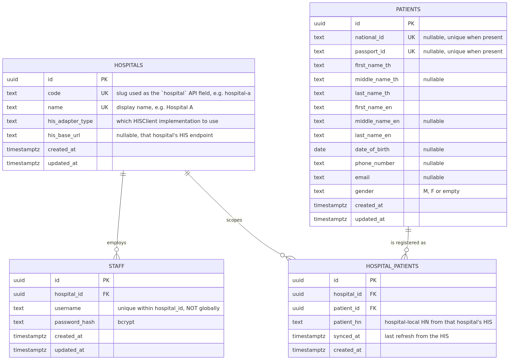
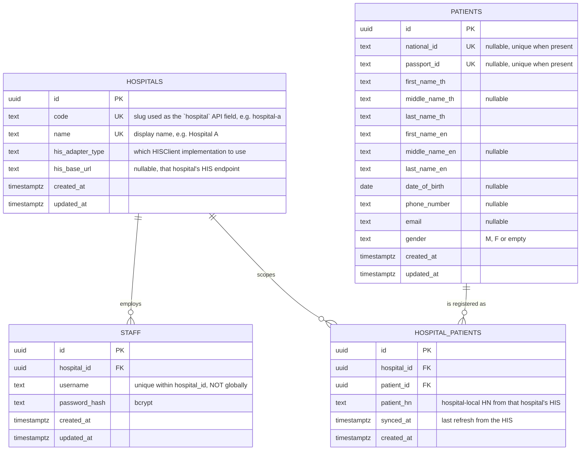

# ER Diagram — Hospital Middleware

Rendered image: [`assets/er-diagram.png`](assets/er-diagram.png) ·
vector: [`assets/er-diagram.svg`](assets/er-diagram.svg) ·
source: [`assets/er-diagram.mmd`](assets/er-diagram.mmd)



## Diagram



Source of truth: [`migrations/000001_init_schema.up.sql`](../migrations/000001_init_schema.up.sql).

---

## Design decisions

### Why `patients` is split from `hospital_patients`

The same real person can be a patient at several hospitals, and each hospital's
HIS assigns them its own local `patient_hn`. A single flat table keyed by
`(hospital_id, hn)` would mean:

- no way to recognise "this is the same human" across hospitals,
- the person's demographics duplicated and drifting per hospital,
- no place to put a cross-hospital identity in future.

Splitting in two gives each table one job:

| Table | Answers |
|---|---|
| `patients` | *Who is this person?* Keyed by the identifiers that are unique across all hospitals — `national_id` / `passport_id`. |
| `hospital_patients` | *Does this hospital know them, and what do they call them?* Carries `patient_hn` and `synced_at`. |

It also makes the assignment's core access rule a property of the schema rather
than of the application code. `hospital_patients.hospital_id` is the scoping
column, and every patient query **starts from `hospital_patients`**:

```sql
FROM hospital_patients hp
JOIN patients p ON p.id = hp.patient_id
WHERE hp.hospital_id = $1   -- from the JWT, always present
  AND ...
```

A patient row that exists only for another hospital is not reachable by that
statement at all — there is no code path, including the HIS fallback, that can
return it.

### Why `staff.username` is unique per hospital, not globally

The assignment's `/staff/login` takes `hospital` as an input. That only makes
sense if `username` alone cannot identify an account — so two hospitals may
each employ a `jsmith`. Enforced by a composite unique index:

```sql
CREATE UNIQUE INDEX ux_staff_hospital_username ON staff (hospital_id, lower(username));
```

Consequence, enforced in `StaffRepository`: the login lookup is always on the
`(hospital_id, username)` pair. There is no query in the codebase that selects
a staff row by username alone.

### Why `staff.hospital_id` is a plain FK

Each staff member belongs to exactly one hospital, so a single FK suffices. If
cross-hospital staff ever become a requirement, this becomes a `staff_hospitals`
link table — the same pattern as `hospital_patients`, and every search would
then filter on a set of hospital ids instead of one.

### Why `hospitals` carries `his_adapter_type` and `his_base_url`

Only "Hospital A" is specified today, but the wording ("Hospital A API") implies
Hospital B, C… each with their own payload shape. Storing *which adapter* a
hospital uses means supporting a new HIS is: add a `HISClient` implementation,
add a case in the factory, insert a row. No schema migration, no changes in the
service or handler layers.

### Why identifiers are nullable but constrained

A patient may have a national id, a passport id, or both — but never neither,
or we could not dedupe them across hospitals:

```sql
CONSTRAINT ck_patients_has_identifier
    CHECK (national_id IS NOT NULL OR passport_id IS NOT NULL)
```

Uniqueness uses **partial** indexes (`WHERE national_id IS NOT NULL`), so many
patients can have a NULL passport id while every present one stays unique. This
is also why the HIS upsert is a find-then-write rather than a single
`ON CONFLICT`: a record can collide on either index, which one conflict target
cannot express.

---

## Indexes and constraints

| Index / constraint | Purpose |
|---|---|
| `ux_hospitals_code`, `ux_hospitals_name` | `hospital` may be given as either form at login |
| `ux_staff_hospital_username` on `(hospital_id, lower(username))` | usernames unique per hospital, case-insensitive |
| `ix_staff_hospital_id` | every login and search filters by hospital |
| `ux_patients_national_id` (partial) | one canonical person per national id |
| `ux_patients_passport_id` (partial) | one canonical person per passport id |
| `ck_patients_has_identifier` | a person must be identifiable across hospitals |
| `ck_patients_gender` | `M`, `F` or empty |
| `ux_hospital_patients_hospital_patient` | a patient is registered once per hospital |
| `ux_hospital_patients_hospital_hn` | an HN is unique within a hospital |
| `ix_hospital_patients_patient_id` | reverse lookup: which hospitals know this person |
| `ix_patients_*` on `lower(name)`, dob, phone, `lower(email)` | back the search filters |

## Rolling migrations back

`staff.hospital_id` and `hospital_patients.hospital_id` both reference
`hospitals` with `ON DELETE CASCADE`. That is correct for the forward
direction — deleting a hospital should not leave orphaned staff — but it makes
the *seed* migration's rollback dangerous: an unconditional
`DELETE FROM hospitals` in `000002_seed_hospitals.down.sql` would take every
staff account and every patient link with it.

The down migration is therefore deliberately narrow: it removes a seeded
hospital only when nothing references it.

```sql
DELETE FROM hospitals h
WHERE h.code IN ('hospital-a', 'hospital-b')
  AND NOT EXISTS (SELECT 1 FROM staff s WHERE s.hospital_id = h.id)
  AND NOT EXISTS (SELECT 1 FROM hospital_patients hp WHERE hp.hospital_id = h.id);
```

**If you edit that file, keep the guards.** Rolling back a seed must not
destroy the data that accumulated on top of it. CI runs `up → down → up`
against a real Postgres, which is the only check that the `.down.sql` files
execute at all.

## Known limitations

- **Name search uses `ILIKE '%term%'`,** which cannot use the `lower(...)`
  btree indexes for a leading wildcard. At a few hundred thousand patients this
  is fine; beyond that, switch to `pg_trgm` GIN indexes. The query shape does
  not change, only the index.
- **`synced_at` is recorded but not yet acted on.** A natural next step is
  re-fetching from the HIS when a local record is older than some TTL, rather
  than only when it is absent.
- **No soft delete.** Patient records are never deleted by this service; the
  HIS remains the source of truth.
